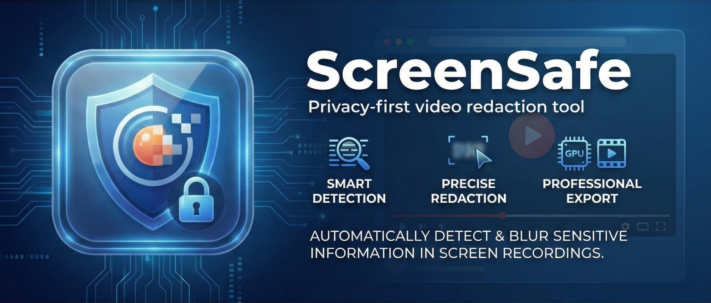

# ScreenSafe

**Privacy-first video redaction tool** — Automatically detect and blur sensitive information in screen recordings before sharing.



## Features

🔍 **Smart Detection**
- Watchlist-based text matching for specific terms
- Anchor-based detection (blur content relative to labels)
- Manual blur and blackout tools with motion tracking

🎯 **Precise Redaction**
- Real-time blur preview
- Adjustable time ranges per detection
- Spatial resize handles for fine-tuning
- Frame-accurate motion tracking

📼 **Professional Export**
- GPU-accelerated encoding (NVIDIA NVENC)
- Original quality preservation
- Batch processing support

## Installation

### Prerequisites
- Windows 10/11
- Python 3.10+ with pip
- FFmpeg (included or system-installed)
- Node.js 18+ (for development)

### Quick Start

1. **Download** the latest release from [Releases](../../releases)
2. **Extract** to your preferred location
3. **Run** `ScreenSafe.exe`

### Building from Source

```bash
# Clone the repository
git clone https://github.com/yourusername/screensafe.git
cd screensafe

# Install frontend dependencies
npm install

# Install Python dependencies
cd python
pip install -r requirements.txt
cd ..

# Run in development mode
npm run tauri dev

# Build for production
npm run tauri build
```

## Usage

### Basic Workflow

1. **Load Video** — Drag & drop or click to select a video file
2. **Configure Detection** — Add watchlist items or anchors in the Config Panel
3. **Scan** — Click "Scan" to detect sensitive content
4. **Review** — Check detections in the sidebar, adjust time ranges in the timeline
5. **Export** — Click "Export" to create the redacted video

### Detection Methods

| Method | Best For | How It Works |
|--------|----------|--------------|
| **Watchlist** | Known text (emails, names) | Exact text matching with OCR |
| **Anchors** | Form fields, labels | Detects text near a reference label |
| **Manual Blur** | Arbitrary regions | Draw box with motion tracking |
| **Blackout** | Complete concealment | Solid black overlay with tracking |

### Keyboard Shortcuts

| Key | Action |
|-----|--------|
| `Space` | Play/Pause |
| `←` / `→` | Skip 5 seconds |

## Technology Stack

- **Frontend**: React + TypeScript + Vite
- **Desktop**: Tauri (Rust)
- **Backend**: Python (OCR, motion tracking)
- **OCR**: EasyOCR / Tesseract
- **Video**: FFmpeg with NVENC support

## Project Structure

```
screensafe/
├── src/                 # React frontend
│   ├── components/      # UI components
│   ├── lib/             # Tauri bindings
│   └── types.ts         # TypeScript types
├── src-tauri/           # Rust backend
├── python/              # Python analysis engine
│   ├── analysis/        # OCR and detection modules
│   └── main.py          # Sidecar entry point
└── public/              # Static assets
```

## Configuration

Settings are accessible via the ⚙️ Settings button:

- **Scan Interval** — Frames between OCR scans (higher = faster, lower = more accurate)
- **Motion Threshold** — Sensitivity for motion tracking
- **OCR Scale** — Resolution multiplier for OCR accuracy

## License

MIT License — see [LICENSE](LICENSE) for details.

## Contributing

Contributions welcome! Please read our contributing guidelines before submitting PRs.

## Acknowledgments

- [Tauri](https://tauri.app/) — Desktop framework
- [EasyOCR](https://github.com/JaidedAI/EasyOCR) — Text recognition
- [FFmpeg](https://ffmpeg.org/) — Video processing
